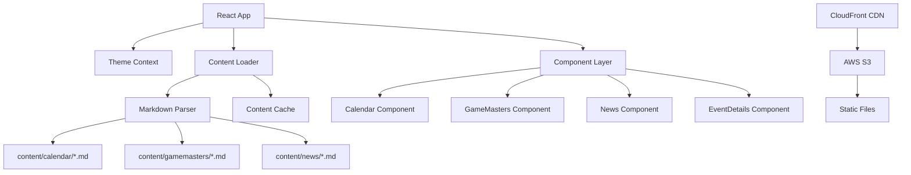

# Design Document

## Overview

The Shifting Corridors Lodge website is a React-based static site that serves gaming community content through markdown files. The architecture emphasizes static generation, theme flexibility, and mobile responsiveness while maintaining type safety through TypeScript. The site will be deployed to AWS S3 as a static website with CloudFront for global distribution.

## Architecture

### High-Level Architecture



### Technology Stack

- **Frontend Framework**: React 18+ with TypeScript
- **Build Tool**: Create React App with TypeScript template
- **Styling**: CSS Modules with theme variables
- **Markdown Processing**: react-markdown with frontmatter parsing
- **State Management**: React Context for theme and content
- **Analytics**: Fathom Analytics for privacy-focused user tracking
- **Testing**: Jest + React Testing Library
- **Deployment**: AWS S3 + CloudFront
- **CI/CD**: GitHub Actions for automated deployment

## Components and Interfaces

### Core Components

#### App Component
```typescript
interface AppProps {}

interface AppState {
  currentTheme: 'medieval' | 'sci-fi';
  content: ContentState;
}
```

#### Calendar Component
```typescript
interface CalendarProps {
  events: CalendarEvent[];
  onEventSelect: (event: CalendarEvent) => void;
}

interface CalendarEvent {
  id: string;
  title: string;
  date: Date;
  description: string;
  content: string;
  gamemaster?: string;
  gameType: 'Pathfinder' | 'Starfinder' | 'Legacy';
}
```

#### GameMasters Component
```typescript
interface GameMastersProps {
  gamemasters: GameMaster[];
  onGameMasterSelect: (gm: GameMaster) => void;
}

interface GameMaster {
  id: string;
  name: string;
  organizedPlayId: string;
  games: ('Pathfinder' | 'Starfinder' | 'Legacy')[];
  bio: string;
  avatar?: string;
}
```

#### News Component
```typescript
interface NewsProps {
  articles: NewsArticle[];
  maxItems?: number;
}

interface NewsArticle {
  id: string;
  title: string;
  date: Date;
  excerpt: string;
  content: string;
  author?: string;
}
```

#### UpcomingEvents Component
```typescript
interface UpcomingEventsProps {
  events: CalendarEvent[];
  maxEvents: number;
}
```

### Content Management

#### Content Loader Service
```typescript
interface ContentLoader {
  loadCalendarEvents(): Promise<CalendarEvent[]>;
  loadGameMasters(): Promise<GameMaster[]>;
  loadNewsArticles(): Promise<NewsArticle[]>;
  parseMarkdownFile(path: string): Promise<MarkdownContent>;
}

interface MarkdownContent {
  frontmatter: Record<string, any>;
  content: string;
}
```

#### Markdown File Structure

**Calendar Events** (`content/calendar/*.md`):
```yaml
---
title: "Game Night Session"
date: "2025-07-13"
gamemaster: "josh-g"
gameType: "Pathfinder"
maxPlayers: 6
---
Event description content...
```

**Game Masters** (`content/gamemasters/*.md`):
```yaml
---
name: "Josh G"
organizedPlayId: "12345"
games: ["Pathfinder", "Starfinder"]
avatar: "/images/josh-g.jpg"
---
Bio content...
```

**News Articles** (`content/news/*.md`):
```yaml
---
title: "New Lodge Website"
date: "2025-06-30"
author: "Lodge Admin"
excerpt: "Welcome to our new website..."
---
Full article content...
```

## Data Models

### Theme System

```typescript
interface Theme {
  name: 'medieval' | 'sci-fi';
  colors: {
    primary: string;
    secondary: string;
    background: string;
    text: string;
    accent: string;
  };
  fonts: {
    heading: string;
    body: string;
  };
  components: {
    button: string;
    card: string;
    panel: string;
  };
}

interface ThemeContext {
  currentTheme: Theme;
  availableThemes: Theme[];
  setTheme: (themeName: string) => void;
}
```

### Content State Management

```typescript
interface ContentState {
  events: CalendarEvent[];
  gamemasters: GameMaster[];
  news: NewsArticle[];
  loading: boolean;
  error: string | null;
  lastUpdated: Date;
}

interface ContentActions {
  loadContent: () => Promise<void>;
  refreshContent: () => Promise<void>;
  selectEvent: (eventId: string) => void;
  selectGameMaster: (gmId: string) => void;
}
```

## Error Handling

### Content Loading Errors
- Graceful degradation when markdown files are missing
- Error boundaries for component-level failures
- Fallback content for network issues
- User-friendly error messages

### Markdown Parsing Errors
- Validation of frontmatter structure
- Default values for missing metadata
- Content sanitization for security
- Logging of parsing issues

### Theme Loading Errors
- Fallback to default theme
- Validation of theme configuration
- CSS loading error handling

## Testing Strategy

### Unit Testing
- **Component Tests**: Each React component with props variations
- **Service Tests**: Content loading and markdown parsing
- **Utility Tests**: Theme switching and date formatting
- **Hook Tests**: Custom hooks for content management

### Integration Testing
- **Content Flow**: End-to-end content loading and display
- **Theme Switching**: Complete theme change workflow
- **Navigation**: Component interaction and routing
- **Mobile Responsiveness**: Layout adaptation testing

### Test Structure
```
src/
├── components/
│   ├── Calendar.tsx
│   ├── Calendar.test.tsx
│   ├── GameMasters.tsx
│   └── GameMasters.test.tsx
├── services/
│   ├── contentLoader.ts
│   └── contentLoader.test.ts
├── utils/
│   ├── markdownParser.ts
│   └── markdownParser.test.ts
└── __tests__/
    ├── integration/
    └── e2e/
```

### Testing Tools
- **Jest**: Unit and integration testing
- **React Testing Library**: Component testing
- **MSW**: API mocking for content loading
- **Cypress**: End-to-end testing (optional)

## Deployment Architecture

### AWS S3 Static Hosting
- **Bucket Configuration**: Public read access for website hosting
- **Index Document**: index.html with client-side routing support
- **Error Document**: 404.html with fallback to index.html
- **CORS Configuration**: Allow cross-origin requests for assets

### CloudFront Distribution
- **Origin**: S3 bucket website endpoint
- **Caching**: Aggressive caching for static assets, minimal for HTML
- **Compression**: Gzip compression enabled
- **Custom Domain**: Optional custom domain configuration

### Build Process
```yaml
# GitHub Actions Workflow
name: Deploy to AWS S3
on:
  push:
    branches: [main]
jobs:
  build-and-deploy:
    runs-on: ubuntu-latest
    steps:
      - uses: actions/checkout@v3
      - name: Setup Node.js
        uses: actions/setup-node@v3
        with:
          node-version: '18'
      - name: Install dependencies
        run: npm ci
      - name: Run tests
        run: npm test -- --coverage --watchAll=false
      - name: Build application
        run: npm run build
      - name: Deploy to S3
        run: aws s3 sync build/ s3://${{ secrets.S3_BUCKET }} --delete
      - name: Invalidate CloudFront
        run: aws cloudfront create-invalidation --distribution-id ${{ secrets.CLOUDFRONT_ID }} --paths "/*"
```

## Mobile Responsiveness

### Breakpoints
- **Mobile**: 320px - 768px
- **Tablet**: 768px - 1024px
- **Desktop**: 1024px+

### Layout Adaptations
- **Navigation**: Collapsible hamburger menu on mobile
- **Calendar**: Compact view with swipe navigation
- **Side Panel**: Converts to bottom panel on mobile
- **Game Masters**: Grid layout adapts from 3 columns to 1
- **Typography**: Responsive font scaling

### Touch Interactions
- **Tap Targets**: Minimum 44px touch targets
- **Gestures**: Swipe navigation for calendar
- **Hover States**: Touch-appropriate feedback
- **Accessibility**: Screen reader support

## Analytics Integration

### Fathom Analytics
- **Privacy-First**: GDPR-compliant analytics without cookies
- **Implementation**: Fathom script integration in index.html
- **Event Tracking**: Custom events for theme switching, content interactions
- **Page Views**: Automatic page view tracking for all routes
- **Goals**: Track key user actions (event clicks, GM profile views, theme changes)

### Analytics Configuration
```typescript
interface AnalyticsConfig {
  siteId: string;
  trackingEnabled: boolean;
  customEvents: {
    themeSwitch: string;
    eventView: string;
    gmProfileView: string;
    newsArticleView: string;
  };
}
```

### Event Tracking Implementation
```typescript
// Analytics service
interface AnalyticsService {
  trackPageView(path: string): void;
  trackEvent(eventName: string, value?: number): void;
  trackThemeSwitch(theme: string): void;
  trackContentInteraction(type: 'event' | 'gm' | 'news', id: string): void;
}
```

## Performance Considerations

### Bundle Optimization
- **Code Splitting**: Lazy loading for non-critical components
- **Tree Shaking**: Remove unused dependencies
- **Asset Optimization**: Image compression and WebP format
- **CSS Optimization**: Critical CSS inlining

### Content Loading
- **Caching**: Browser caching for markdown content
- **Preloading**: Critical content preloading
- **Lazy Loading**: Non-visible content lazy loading
- **Error Recovery**: Retry mechanisms for failed loads

### Monitoring
- **Core Web Vitals**: LCP, FID, CLS tracking
- **Error Tracking**: Client-side error reporting
- **Performance Metrics**: Load time and interaction tracking
- **Fathom Analytics**: Privacy-focused user behavior tracking